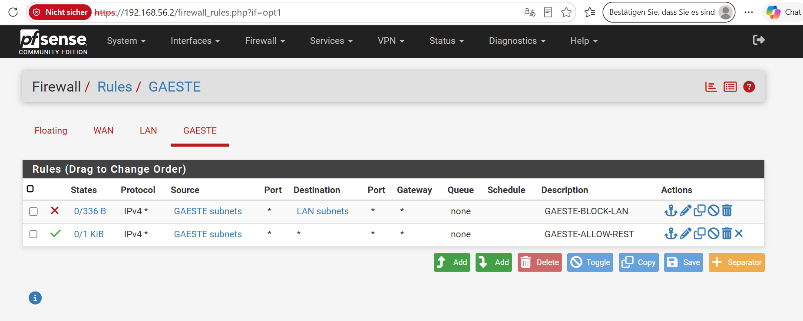
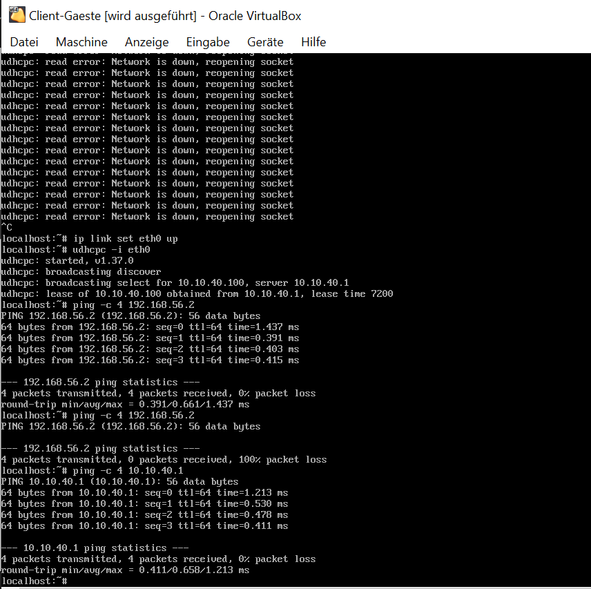

# Network Home Lab — CCNA Preparation

Hands-on lab work on switching, routing and firewall fundamentals, built and documented step by step. The focus is not only on working configurations but on understanding *why* they work: every lab includes an address plan, the relevant configuration, verification output and the key takeaway. Every problem I ran into is documented as a troubleshooting case.

**Started:** September 2026
**Tools:** Cisco Packet Tracer 9.0.1 · pfSense CE 2.9.0 · VirtualBox 7.2.18 · Alpine Linux 3.24
**Hardware:** Dell Latitude 5490 (Intel Core i5, 8th gen)

> Some configuration names are German because the labs were built in German, e.g. `GAESTE` = guests, `Vertrieb` = sales, `Buchhaltung` = accounting.

---

## Overview

| Lab | Topic | Environment |
|-----|-------|-------------|
| [Lab 00](#lab-00--basic-setup-one-switch-three-hosts) | Layer-2 basics: one switch, three hosts | Packet Tracer |
| [Lab 01](#lab-01--vlans-and-inter-vlan-routing-router-on-a-stick) | VLANs, 802.1Q trunk, inter-VLAN routing | Packet Tracer |
| [Lab 02](#lab-02--guest-vlan-with-acl-natpat-and-port-security) | Guest VLAN isolated by ACL, NAT/PAT, port security | Packet Tracer |
| [Lab 03](#lab-03--pfsense-firewall-with-an-isolated-guest-segment) | pfSense firewall, guest segment, rules verified from a real client VM | VirtualBox |
| [Troubleshooting](#troubleshooting-cases) | 7 documented cases | — |

## Repository structure

```
/labs   Packet Tracer files (.pkt) and pfSense configuration export
/docs   Topology diagrams and screenshots
```

---

## Lab 00 — Basic setup: one switch, three hosts

**Goal:** Get started with Packet Tracer and understand Layer-2 forwarding inside a single subnet.

```
        PC0
         |
   [ Switch0 ]---- PC2
    2960-24TT
         |
        PC1
```

| Device | IP address   | Subnet mask   | Switch port |
|--------|--------------|---------------|-------------|
| PC0    | 192.168.1.10 | 255.255.255.0 | Fa0/1       |
| PC1    | 192.168.1.11 | 255.255.255.0 | Fa0/2       |
| PC2    | 192.168.1.12 | 255.255.255.0 | Fa0/3       |

**Configuration:** Static IPv4 addresses, no default gateway (all hosts are in the same subnet, so no routing is needed).

**Verification:**

```
C:\>ping 192.168.1.11
Packets: Sent = 4, Received = 4, Lost = 0 (0% loss)

C:\>ping 192.168.1.12
Packets: Sent = 4, Received = 4, Lost = 0 (0% loss)
```

**Takeaway:** The switch forwards frames based on its MAC address table; no Layer-3 configuration is required. When a cable is connected, the link light takes a few seconds to turn from orange to green because Spanning Tree moves the port through its states before forwarding.

---

## Lab 01 — VLANs and inter-VLAN routing (router-on-a-stick)

**Goal:** Put three departments into separate VLANs and let them communicate through one router using subinterfaces.

```
                 [ Router0 ] 2911
                       |
                  (Trunk, Fa0/1)
                       |
                 [ Switch0 ] 2960-24TT
                 /      |      \
             Fa0/2   Fa0/3   Fa0/4
               |        |        |
              PC0      PC1      PC2
           (VLAN 10) (VLAN 20) (VLAN 30)
```

| VLAN | Department (config name) | Network         | Gateway      | Switch port | PC IP         |
|------|--------------------------|-----------------|--------------|-------------|---------------|
| 10   | Sales (`Vertrieb`)       | 192.168.10.0/24 | 192.168.10.1 | Fa0/2       | 192.168.10.10 |
| 20   | Accounting (`Buchhaltung`) | 192.168.20.0/24 | 192.168.20.1 | Fa0/3     | 192.168.20.11 |
| 30   | IT                       | 192.168.30.0/24 | 192.168.30.1 | Fa0/4       | 192.168.30.10 |

*PC1 was given .11 instead of .10 during the first setup. It makes no technical difference, so I left it as is.*

**Configuration:**
- Router: three subinterfaces on GigabitEthernet0/0 (`.10`, `.20`, `.30`), each with `encapsulation dot1Q <VLAN-ID>` and its own gateway IP
- Switch: VLANs 10, 20 and 30 created, access ports assigned, Fa0/1 towards the router configured as trunk (`switchport mode trunk`)
- PCs: static IP per subnet, default gateway pointing to the matching router subinterface

**Verification:**

```
Router#ping 192.168.10.10   → Success rate 80% (4/5)
Router#ping 192.168.20.11   → Success rate 80% (4/5)
Router#ping 192.168.30.10   → Success rate 80% (4/5)
```

The first lost packet per destination is expected: it is spent on ARP resolution.

**Takeaway:** One physical router port can serve several VLANs through 802.1Q subinterfaces. The switch port towards the router has to be a trunk, otherwise the VLAN tags never arrive; an access port would only carry one VLAN.

---

## Lab 02 — Guest VLAN with ACL, NAT/PAT and port security

**Goal:** Add a fourth VLAN for guests, block its access to the three internal networks with an ACL, translate all internal networks to one WAN address with PAT, and lock one switch port to a single device with port security.


*Logical view in Packet Tracer: Router0 (2911) with Switch0 (2960-24TT), PC0–PC3 in VLANs 10/20/30/40, PC4 on router port Gi0/1 simulating the internet.*

| VLAN | Area (config name) | Network         | Gateway      | Switch port | PC IP         |
|------|--------------------|-----------------|--------------|-------------|---------------|
| 40   | Guests (`Gaeste`)  | 192.168.40.0/24 | 192.168.40.1 | Fa0/5       | 192.168.40.10 |

WAN side: router Gi0/1 = 203.0.113.1/24, PC4 ("internet") = 203.0.113.10/24

### 1. ACL — isolate the guest VLAN from internal networks

```
ip access-list extended GAESTE-BLOCK
 deny ip 192.168.40.0 0.0.0.255 192.168.10.0 0.0.0.255
 deny ip 192.168.40.0 0.0.0.255 192.168.20.0 0.0.0.255
 deny ip 192.168.40.0 0.0.0.255 192.168.30.0 0.0.0.255
 permit ip any any

interface gigabitEthernet0/0.40
 ip access-group GAESTE-BLOCK in
```

**Before (no ACL):**
```
PC3>ping 192.168.10.10   → 4/4 received
PC3>ping 192.168.20.11   → 4/4 received
PC3>ping 192.168.30.10   → 4/4 received
```

**After (ACL applied):**
```
PC3>ping 192.168.10.10   → Destination host unreachable (4/4)
PC3>ping 192.168.20.11   → Destination host unreachable (4/4)
PC3>ping 192.168.30.10   → Destination host unreachable (4/4)
```

**Takeaway:** "Destination host unreachable" instead of a plain timeout shows that the router actively rejects the traffic. The ACL is applied inbound on the guest subinterface, so packets are dropped before any routing decision.

### 2. NAT/PAT — translate internal networks to the WAN address

```
interface gigabitEthernet0/1
 ip address 203.0.113.1 255.255.255.0
 ip nat outside

interface gigabitEthernet0/0.10
 ip nat inside
[... same for .20, .30, .40 ...]

ip access-list standard NAT-INSIDE
 permit 192.168.10.0 0.0.0.255
 permit 192.168.20.0 0.0.0.255
 permit 192.168.30.0 0.0.0.255
 permit 192.168.40.0 0.0.0.255

ip nat inside source list NAT-INSIDE interface gigabitEthernet0/1 overload
```

**Verification:**
```
PC0>ping 203.0.113.10   → 3/4 received (first timeout: ARP)

Router#show ip nat translations
Pro  Inside global    Inside local       Outside local    Outside global
icmp 203.0.113.1:1    192.168.10.10:1    203.0.113.10:1   203.0.113.10:1
icmp 203.0.113.1:2    192.168.10.10:2    203.0.113.10:2   203.0.113.10:2
```

**Takeaway:** PAT maps every internal address to the same public IP and keeps parallel connections apart by port number. Without NAT, PC0 would send packets with a private source address, which would not be routed on a real internet.

### 3. Port security — lock Fa0/2 to one device

```
interface fastEthernet0/2
 switchport port-security
 switchport port-security maximum 1
 switchport port-security violation shutdown
 switchport port-security mac-address sticky
```

**Verification:**
```
Switch#show port-security interface fastEthernet0/2
Port Security          : Enabled
Port Status            : Secure-up
Violation Mode         : Shutdown
Maximum MAC Addresses  : 1
Total MAC Addresses    : 1
Sticky MAC Addresses   : 1
Last Source Address:Vlan : 00D0.9759.AA39:10
```

**Takeaway:** With sticky learning, the MAC address is learned only once traffic actually passes the port, not when the configuration is applied. A test ping from PC0 was needed before the address appeared.

---

## Lab 03 — pfSense firewall with an isolated guest segment

**Goal:** Move from simulation to a real firewall running in a VM. Build an isolated guest segment and protect the internal network with firewall rules, the same policy as the ACL in Lab 02, but verified from a real operating system instead of a simulator.

**Environment:**
- VirtualBox 7.2.18 on a Windows host
- pfSense CE 2.9.0 (amd64), installed with the Netgate Installer
- VM "pfSense-Firewall": 1 GB RAM, 16 GB disk (ZFS)

| VirtualBox adapter | Mode | pfSense interface | Address |
|--------------------|------|-------------------|---------|
| Adapter 1 | NAT | em0 = WAN | 10.0.2.15/24 (DHCP) |
| Adapter 2 | Host-only | em1 = LAN | 192.168.56.2/24 |
| Adapter 3 | Internal network `gaeste-net` | em2 = OPT1 "GAESTE" | 10.10.40.1/24 |

The Windows host sits in the host-only network (192.168.56.1) and manages pfSense through the web GUI.

**Base configuration (setup wizard):**
- WAN: "Block RFC1918 private networks" and "Block bogon networks" disabled, because the WAN itself is a private network (VirtualBox NAT, 10.0.2.0/24)
- LAN: pfSense DHCP server disabled, because VirtualBox already runs a DHCP server in the host-only network
- Default admin password replaced

**Guest segment (OPT1 "GAESTE"):**
- Third VirtualBox network of type "internal network", assigned in pfSense as OPT1
- Static address 10.10.40.1/24
- DHCP server enabled, pool 10.10.40.100–10.10.40.200

**Firewall rules on GAESTE** (evaluated top to bottom, first match wins):

| # | Action | Source | Destination | Description |
|---|--------|--------|-------------|-------------|
| 1 | Block | GAESTE subnets | LAN subnets | GAESTE-BLOCK-LAN |
| 2 | Pass  | GAESTE subnets | any | GAESTE-ALLOW-REST |



**Verification from a real client VM:**
A second VM "Client-Gaeste" (Alpine Linux 3.24 live system, 256 MB RAM) was connected to `gaeste-net`. It received a DHCP lease (10.10.40.100 from 10.10.40.1), then:

```
# Guest gateway: must be reachable
ping -c 4 10.10.40.1
4 packets transmitted, 4 packets received, 0% packet loss

# pfSense LAN: must be blocked
ping -c 4 192.168.56.2
4 packets transmitted, 0 packets received, 100% packet loss
```



Both results match the policy: traffic inside the guest segment works, access to the LAN is blocked.

**Takeaways:**
- In a virtual environment, the hypervisor decides which networks exist. The firewall has to fit into those networks (here 192.168.56.0/24), not the other way round, otherwise the management GUI is unreachable from the host.
- Rule order matters: the block rule must sit above the broad pass rule. After reordering, the change only took effect once it was saved and applied (see case 7).

---

## Troubleshooting cases

Every case follows the same structure:

1. **Symptom** — what can be observed
2. **Hypothesis** — the most likely cause
3. **Check** — commands or tests that narrow it down
4. **Root cause** — what it actually was
5. **Fix** — what was changed

### Case 1 — Host cannot reach its gateway despite correct configuration (Lab 01)

1. **Symptom:** `ping 192.168.10.1` from PC0 to its own gateway failed (100% loss), although VLANs, trunk and subinterfaces were configured.
2. **Hypothesis:** Error in the router or switch configuration.
3. **Check:** `show ip interface brief` on the router (all subinterfaces up/up), `show vlan brief` and `show interfaces trunk` on the switch — all correct.
4. **Root cause:** PC0 was never connected to the switch. The cable had been connected to the router by mistake: a cabling error, not a configuration problem.
5. **Fix:** Removed the wrong link and connected PC0 to switch access port Fa0/2. The ping succeeded immediately.

**Lesson:** Check the physical topology first. A correct configuration on a device that is not connected achieves nothing.

### Case 2 — Missing router subinterface for a new VLAN (Lab 02)

1. **Symptom:** PC3 in the new guest VLAN 40 could not reach its gateway 192.168.40.1.
2. **Hypothesis:** Error in the VLAN assignment on the switch or on the router.
3. **Check:** `show ip interface brief` on the router showed no line for `GigabitEthernet0/0.40`.
4. **Root cause:** The subinterface for VLAN 40 had never been created. The switch side was correct, the router side was missing.
5. **Fix:** Created `GigabitEthernet0/0.40` with `encapsulation dot1Q 40` and 192.168.40.1/24. The ping succeeded immediately.

**Lesson:** A new VLAN always needs both sides: VLAN and access port on the switch, and the matching subinterface on the router.

### Case 3 — Wrong target device because of unclear port-to-VLAN mapping (Lab 02)

1. **Symptom:** Ping from PC3 to 192.168.10.10 failed, although router, switch and trunk were each confirmed as correct.
2. **Hypothesis:** ACL or routing error.
3. **Check:** Systematic elimination: `show access-lists` (empty), `show ip route` (all networks connected), `show vlan brief` and `show interfaces status` (ports correctly assigned). A control test between two other VLANs worked.
4. **Root cause:** Some target PCs had wrong or unsaved IP settings. Device names (PC0, PC1, PC2) did not follow the VLAN order, which caused mix-ups about which PC was connected to which port.
5. **Fix:** Determined the real port-to-VLAN mapping with `show vlan brief` and `show interfaces status`, then reconfigured the PCs based on the physical port, not the device name.

**Lesson:** Device names say nothing about VLAN membership. Verify through the switch port, don't guess from the name.

### Case 4 — Gateway shown but not actually applied (Lab 02)

1. **Symptom:** PC3 reached its own gateway but no other VLAN, although router, switch, trunk and all target devices were verified.
2. **Hypothesis:** Default gateway on PC3 not applied, even though the field showed a value.
3. **Check:** After ruling out all network components (see case 3), only PC3 itself remained.
4. **Root cause:** The gateway field displayed a value that was not actually active.
5. **Fix:** Re-entered the gateway. All three targets were reachable immediately.

**Lesson:** A displayed configuration is not necessarily the active configuration.

### Case 5 — Reboot loop after a finished pfSense installation (Lab 03)

1. **Symptom:** After "Installation complete", every reboot attempt returned to the installer shell with `Shared object "libcurl.so.4" not found` and `reboot: Device not configured`.
2. **Hypothesis:** Failed installation or damaged disk.
3. **Check:** The installer had reported success. The errors started right after the ISO was ejected from the virtual drive.
4. **Root cause:** The installer runs as a live system from the ISO. Ejecting it while running removed files it still needed, so even the reboot command failed. The installation on disk was intact.
5. **Fix:** Hard reset of the VM. It booted from the virtual disk straight into the pfSense console.

**Lesson:** A live installer needs its boot medium until the very end. Shut down or reboot first, then remove the medium.

### Case 6 — Web GUI unreachable because of a subnet mismatch (Lab 03)

1. **Symptom:** After the first boot, pfSense reported LAN = 192.168.1.1/24, while the Windows host was in the VirtualBox host-only network 192.168.56.0/24.
2. **Hypothesis:** Host and firewall LAN in different subnets with no router between them.
3. **Check:** Compared the pfSense console output with the default range of the VirtualBox host-only adapter.
4. **Root cause:** pfSense defaults to 192.168.1.1 on LAN; VirtualBox creates its host-only network as 192.168.56.0/24.
5. **Fix:** Set the LAN address to 192.168.56.2/24 through the console menu, without gateway and without a pfSense DHCP server. The web GUI was reachable right away. Changing the host-only network to 192.168.1.x instead was rejected, because many home routers already use that range.

**Lesson:** Before configuring a device, check which network the management machine is actually in.

### Case 7 — Block rule not effective after reordering rules (Lab 03)

1. **Symptom:** After creating a block rule (GAESTE → LAN) and a pass rule (GAESTE → any) and dragging them into the intended order, the test ping from the guest VM to the LAN still succeeded (0% loss).
2. **Hypothesis:** Wrong rule definition (source and destination swapped) or a mistake in the test.
3. **Check:** Rule definition was correct (source GAESTE subnets, destination LAN subnets, action block), and the GUI showed the block rule above the pass rule. However, the states counter of the pass rule showed no traffic after the successful ping, a hint that the displayed rule set was not the one in effect.
4. **Root cause (most likely):** The new order had been dragged into place in the GUI but not saved. Until the order was saved and applied, the previous rule set stayed active.
5. **Fix:** Clicked **Save**, then **Apply Changes**, and repeated the test: ping to the LAN 100% loss, ping to the guest gateway 0% loss. The pass rule now showed state traffic.

**Lesson:** What the GUI shows is not automatically what the firewall enforces; always re-test after a change. Also: block rules do not create states, so an empty states counter on a block rule proves nothing. To confirm hits on a block rule, enable logging on the rule and check the firewall log.

---

## Next steps

- Lab 04 (planned): small Python script against a Cisco DevNet sandbox device to check interface status, capture the configuration before and after a change, and report PASS/FAIL
- Continuing CCNA preparation
